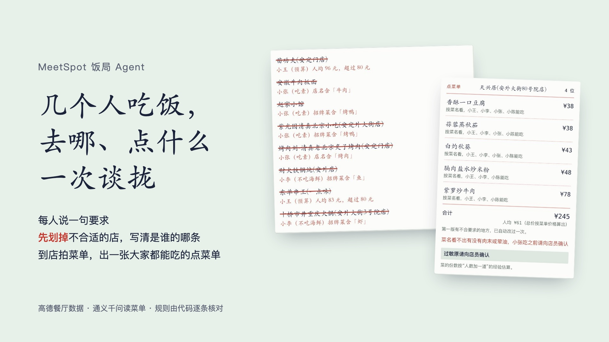

# MeetSpot 饭局 Agent：去哪吃、点什么一次谈拢

几个人约饭，每人说一句要求。它先把不合适的餐厅划掉，并写清是谁的哪条要求；到店拍一下菜单，再出一张大家都能吃、不超预算的点菜单。

在线体验：https://render.qmuse.pub/p/muse/3163078624095246 （点「用示例饭局试一下」不用打字）

## 怎么做的

- 模型只负责两件事：把每个人的原话整理成限制条件，读菜单照片上的菜名和价格。
- 判断全部在代码里（`web/functions/fanju/src/rules.js`）：按预算、品类、店名和招牌菜排除餐厅；点菜时核对菜名必须在菜单上、总价按菜单价格算、每个人至少有两道能吃的菜、人均不超预算。不合格就让模型改一次，还不合格就如实列出哪一条没满足。
- 留下的餐厅标「按品类初筛，未核实」；过敏只做提示，固定显示「过敏原请向店员确认」。

## 结构

- `web/`：QMuse 模板（React + TanStack Router + Tailwind），用 QMuse CLI 导入和部署
- `web/functions/fanju/`：QMuse 云函数（Node 22），调用高德 Web 服务和阿里云百炼 `qwen3.7-flash`
- 测试：`cd web/functions/fanju && npm test`

## 数据来源

- 餐厅：高德地图 Web 服务（地理编码、周边餐饮搜索）
- 示例菜单照片：广州莲香楼菜单实拍，Wikimedia Commons 用户 MeiOLA 2290 WMENSZ 拍摄，CC0

MIT License
